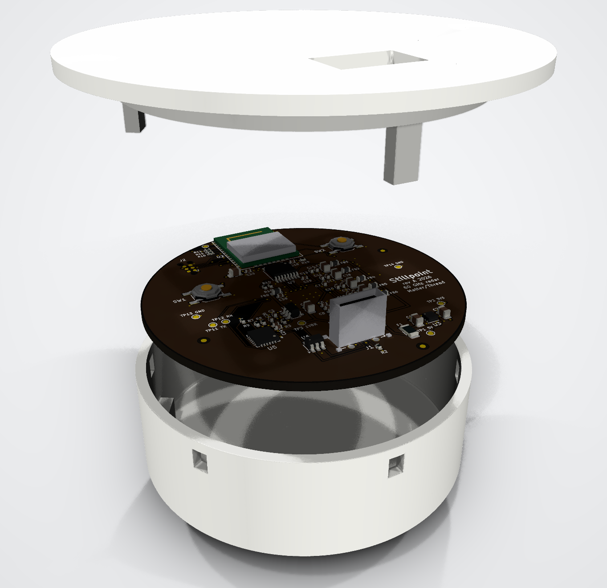

<p align="center">
  
</p>

<h1 align="center">Stillpoint</h1>

<p align="center">
  <b>A privacy-first ceiling sensor that counts people, knows their posture and reports falls,<br>
  using a 60 GHz radar instead of a camera.</b>
</p>

<p align="center">
  <a href="https://github.com/techmiguel/stillpoint/actions/workflows/ci.yml"></a>
  <a href="LICENSE"></a>
  <a href="https://github.com/techmiguel/stillpoint/releases"></a>
</p>

<p align="center"><a href="https://techmiguel.github.io/stillpoint/"><b>Project page →</b></a></p>

- **Sees the room, never the person.** No camera, no microphone. A 60 GHz FMCW radar
  (Infineon BGT60TR13C) measures where people are and how they move.
- **Finds people who are perfectly still**, by the movement of their chest as they
  breathe, so someone sitting or lying quietly does not "disappear".
- **Counts people, tracks position and posture, and reports falls**, all from one stream:
  no modes to switch between.
- **Runs entirely on the device** (Silicon Labs MGM260P / EFR32MG26) and reports over
  **Matter on Thread** with standard clusters: no cloud, no account, works with Home
  Assistant.
- **Open hardware**: KiCad schematic and 4-layer Ø60 mm board, FreeCAD enclosure, C
  firmware and the Python reference it is tested against.

> **Not a medical device.** A fall alert is a notification, never the only safety measure
> for a person.

## The board

| Top (ceiling side) | Bottom (radar, faces the floor) |
|---|---|
|  |  |

| | |
|---|---|
| Size | Ø60 mm round, 4 layers, 1.6 mm, ENIG, JLCPCB standard process |
| Radar | BGT60TR13C on the bottom face, 0.5 mm-pitch BGA, antennas in package |
| Radio + CPU | MGM260P module (Cortex-M33 + MVP accelerator, Matter/Thread/BLE) at the board edge with its antenna keep-out |
| Power | USB-C, 3.3 V LDO, 7 µVrms 1.8 V LDO for the radar, one π filter per radar supply domain |
| Extras | CP2102N USB console, RGB status LED, setup/reset buttons, Tag-Connect SWD, 14 test points |

Layout highlights:

- **Radar ground done by the book.** Solid ground on L2, a ground island on L3 right under
  the chip, nothing but ground vias inside the ball ring, and a custom DRC rule that keeps
  every other net off the inner layers under the radar.
- **Every radar supply is a straight lane** from its ball through 100 nF → 1 µF → 10 µF to
  its ferrite, with the smallest capacitor closest to the ball (Infineon's reference
  filter).
- **No crossing radar lines.** The radar signals leave the MCU from the pad row that faces
  the level translators, and the two translators are split over both faces to match the
  radar's ball order.

Fabrication files (Gerber, drill, BOM and CPL for JLCPCB, schematic PDF, STEP) are in
[`hardware/fabrication/`](hardware/fabrication) and attached to the
[rev A release](https://github.com/techmiguel/stillpoint/releases/tag/rev-a).
Full design notes: [docs/hardware.md](docs/hardware.md).

## The enclosure

A Ø65 mm, 24 mm tall ceiling puck on a Ø77 mm ceiling plate, 3D-printed in natural PETG.
The bottom of the shell is the radome: a flat slab exactly half a wavelength thick inside
the plastic (1.48 mm), so the 60 GHz signal passes through with about 0.15 dB of loss, and
the radar's antennas sit one wavelength (4.95 mm) above it. The board rests on three supports and the lid clamps it
with three posts at the same angles; the USB-C cable leaves through the lid, against the
ceiling.

The FreeCAD model ([`mechanical/enclosure.py`](mechanical/enclosure.py)) loads the real
board STEP and checks that nothing touches the shell, the lid or the radome, and that no
plastic sits in the antennas' ±60° field of view.


## How it works

```
ADC (3 RX × 32 chirps × 128 samples, 10 Hz)
  → range FFT ─┬─ motion path: MTI + Doppler + CFAR + angle   (people who move)
               └─ micro-motion path: 10 s of phase, breathing  (people who are still)
  → 3D detections → tracks with room logic (doors, occlusion, ghosts)
  → 66-byte feature record per track (the contract)
  → int8 CNN (14.6 KB) every 0.5 s → fail-safe decision → Matter
```

The fixes for the classic failures of commercial radar sensors are regression tests:

| Scenario | What the sensor does |
|---|---|
| A person sits still and someone walks in front of them | the hidden person is kept as *occluded*, never dropped |
| An empty room with a fan running | the fan is learned as an interferer and not counted |
| Someone walks next to a mirror | the mirror ghost is recognised as multipath |
| A fall | suspected by the model or by a fast drop to the floor, confirmed after 4 s still on the floor; if it cannot be verified it is reported as *uncertain*, never silenced ([plot](docs/img/fall_events.png)) |


The C firmware is checked frame by frame against the Python reference: same counts,
≥ 99.8 % identical quantized features, and identical postures, fall decisions and alarm
times ([plot](docs/img/app_c_vs_python.png)).

## License

[CERN-OHL-S-2.0](LICENSE) (CERN Open Hardware Licence v2, strongly reciprocal) for the
whole project: schematic, board, mechanics, firmware and documentation.
