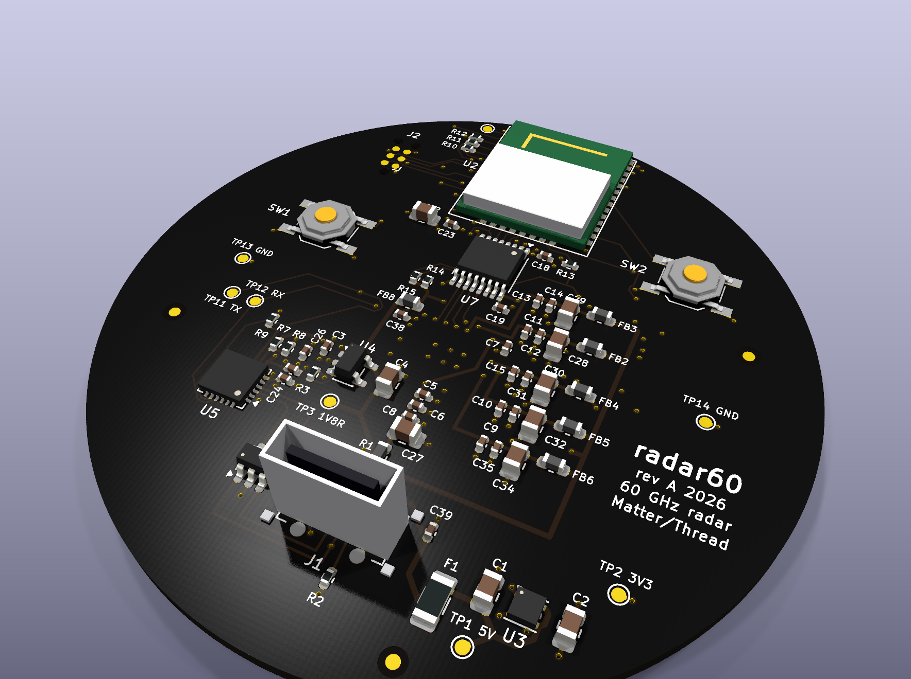
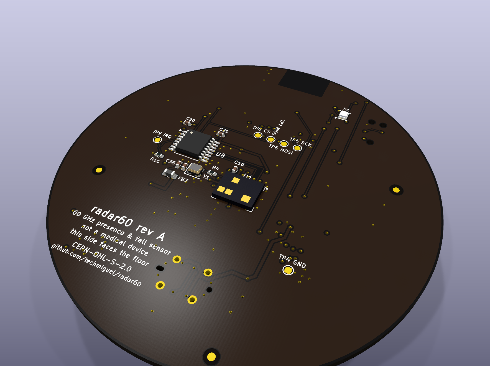
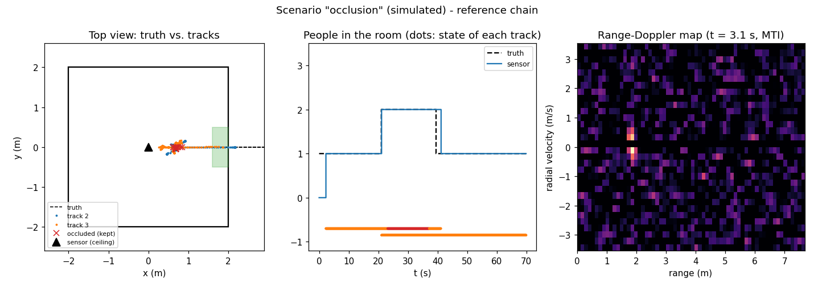

# radar60

**A privacy-first ceiling sensor that counts people, knows their posture and reports
falls, using a 60 GHz radar instead of a camera.**

[](https://github.com/techmiguel/radar60/actions/workflows/ci.yml)
[](LICENSE)
[](https://github.com/techmiguel/radar60/releases)

**[Project page →](https://techmiguel.github.io/radar60/)**

| Top (ceiling side) | Bottom (radar, faces the floor) |
|---|---|
|  |  |

- **Sees the room, never the person.** No camera, no microphone. A 60 GHz FMCW radar
  (Infineon BGT60TR13C) measures where people are and how they move.
- **Finds people who are perfectly still**, by the movement of their chest as they
  breathe, so someone sitting or lying quietly does not "disappear".
- **Counts people, tracks position and posture, and reports falls**, all from one stream:
  no modes to switch between.
- **Runs entirely on the device** (Silicon Labs MGM260P / EFR32MG26) and reports over
  **Matter on Thread** with standard clusters: no cloud, no account, works with Home
  Assistant.
- **Open hardware**: KiCad schematic and 4-layer Ø60 mm board, FreeCAD enclosure, C
  firmware and the Python reference it is tested against.

> **Not a medical device.** A fall alert is a notification, never the only safety measure
> for a person.

## The board

| | |
|---|---|
| Size | Ø60 mm round, 4 layers, 1.6 mm, ENIG, JLCPCB standard process |
| Radar | BGT60TR13C on the bottom face, 0.5 mm-pitch BGA, antennas in package |
| Radio + CPU | MGM260P module (Cortex-M33 + MVP accelerator, Matter/Thread/BLE) at the board edge with its antenna keep-out |
| Power | USB-C, 3.3 V LDO, 7 µVrms 1.8 V LDO for the radar, one π filter per radar supply domain |
| Extras | CP2102N USB console, RGB status LED, setup/reset buttons, Tag-Connect SWD, 14 test points |
| Checks | ERC 0 errors, DRC 0, 0 unconnected, schematic/PCB parity, pin maps checked against datasheets, enclosure interference check against the real board STEP |

Layout highlights:

- **Radar ground done by the book.** Solid ground on L2, a ground island on L3 right under
  the chip, nothing but ground vias inside the ball ring, and a custom DRC rule that keeps
  every other net off the inner layers under the radar.
- **Every radar supply is a straight lane** from its ball through 100 nF → 1 µF → 10 µF to
  its ferrite, with the smallest capacitor closest to the ball (Infineon's reference
  filter).
- **No crossing radar lines.** The radar signals leave the MCU from the pad row that faces
  the level translators, and the two translators are split over both faces to match the
  radar's ball order.
- **Reproducible layout.** Placement and every critical route are Python scripts in
  [`tools/pcb_build/`](tools/pcb_build); Freerouting does the rest.

Fabrication files (Gerber, drill, BOM and CPL for JLCPCB, schematic PDF, STEP) are in
[`hardware/fabrication/`](hardware/fabrication) and attached to the
[rev A release](https://github.com/techmiguel/radar60/releases/tag/rev-a).
Full design notes: [docs/hardware.md](docs/hardware.md).

## How it works

```
ADC (3 RX × 32 chirps × 128 samples, 10 Hz)
  → range FFT ─┬─ motion path: MTI + Doppler + CFAR + angle   (people who move)
               └─ micro-motion path: 10 s of phase, breathing  (people who are still)
  → 3D detections → tracks with room logic (doors, occlusion, ghosts)
  → 66-byte feature record per track (the contract)
  → int8 CNN (14.6 KB) every 0.5 s → fail-safe decision → Matter
```

The fixes for the classic failures of commercial radar sensors are regression tests:

| Scenario | What the sensor does |
|---|---|
| A person sits still and someone walks in front of them | the hidden person is kept as *occluded*, never dropped |
| An empty room with a fan running | the fan is learned as an interferer and not counted |
| Someone walks next to a mirror | the mirror ghost is recognised as multipath |
| A fall | suspected by the model or by a fast drop to the floor, confirmed after 4 s still on the floor; if it cannot be verified it is reported as *uncertain*, never silenced ([plot](docs/img/fall_events.png)) |



The C firmware is checked frame by frame against the Python reference: same counts,
≥ 99.8 % identical quantized features, and identical postures, fall decisions and alarm
times ([plot](docs/img/app_c_vs_python.png)).

## Status

| Part | Status |
|---|---|
| Requirements, acceptance criteria (fixed before any hardware), plan | ✅ [docs](docs) |
| Python reference: FMCW simulator → DSP → tracking → features → int8 model → decision | ✅ [ml/radarref](ml/radarref) |
| Portable C firmware (DSP, tracking, int8 inference, decision, application) | ✅ identical to the reference; gcc and clang `-Werror`, ASan/UBSan clean, CI |
| EFR32MG26 port: radar driver hooks, Matter bridge, UART diagnostics, room config in NVM3 | ✅ written; ⏳ build with the Silicon Labs SDK on the kit |
| Rev A board: schematic, routed 4-layer PCB, fabrication files | ✅ verified; ⏳ order after the kit phase |
| Enclosure, lid, λ/2 radome and its coupon (FreeCAD) | ✅ checked against the board STEP; ⏳ print and pick the thickness with the kit |
| Data capture tools and bench report with confidence intervals | ✅ [ml/capture_kit.py](ml/capture_kit.py), [bench](bench) |
| Real-room data, 30-day bench, published metrics | ⏳ needs hardware and consenting volunteers |

All numbers so far come from **simulation**: they show the chain works end to end, not
how the product performs. They are not published as metrics.

## Try it

Python 3.10+:

```bash
pip install -r requirements.txt
```

Run every test (C is built with gcc, clang or `pip install ziglang`):

```bash
cd ml && python -m unittest discover -s tests -v
```

Firmware tests on the PC:

```bash
make -C firmware test
```

Scenario plots, synthetic dataset, training and event-level evaluation (from `ml/`):

```bash
python plot_scenarios.py
```

```bash
python make_synth_dataset.py --jobs 4
```

```bash
python train.py
```

```bash
python eval_events.py
```

Fabrication files from the current board (KiCad 10):

```bash
python tools/export_fab.py
```

Room configuration for a device on a serial port (needs pyserial):

```bash
python tools/room_cfg.py tools/room_example.json --port COM7
```

## Repository

```
bench/            test bench: annotator, device events, Home Assistant export, report with CIs
contracts/        feature contract between firmware and training (single source of truth)
docs/             requirements, architecture, Matter model, hardware, plan, data protocol
firmware/         portable C + tests against Python golden vectors; port/ = Silicon Labs layer
hardware/         KiCad 10 schematic and board, custom libraries, fabrication/ (JLCPCB)
mechanical/       enclosure, lid and radome (FreeCAD → STEP/STL), checked against the board
ml/               reference chain, simulator, kit capture, training, metrics
tools/            generators, UART diagnostic reader, room configuration, fabrication export
tools/pcb_build/  board generation from the schematic (placement, critical routing)
verification/     kicad-verify: requirements, datasheet pin maps, waivers
```

## Documentation

| | |
|---|---|
| [Requirements](docs/requirements.md) | scope, guardrails, acceptance criteria and the kill criterion |
| [Architecture](docs/architecture.md) | blocks, component choice, compute budget, interfaces, the feature contract |
| [Hardware](docs/hardware.md) | stackup, radar layout, pin map, BOM, datasheet checks, power budget, bring-up |
| [Matter](docs/matter.md) | endpoints and clusters |
| [Regulatory](docs/regulatory.md) | 60 GHz limits in Europe and how the firmware enforces them |
| [Plan and risks](docs/plan.md) | phase gates, what is done, known risks |
| [Data protocol](docs/data-protocol.md) | recording, labelling, splits, consent form |
| [Test bench](docs/test-bench.md) | scenarios and metrics with confidence intervals |
| [References](docs/references.md) | datasheets and application notes |

## License

[CERN-OHL-S-2.0](LICENSE) (CERN Open Hardware Licence v2, strongly reciprocal) for the
whole project: schematic, board, mechanics, firmware and documentation.
