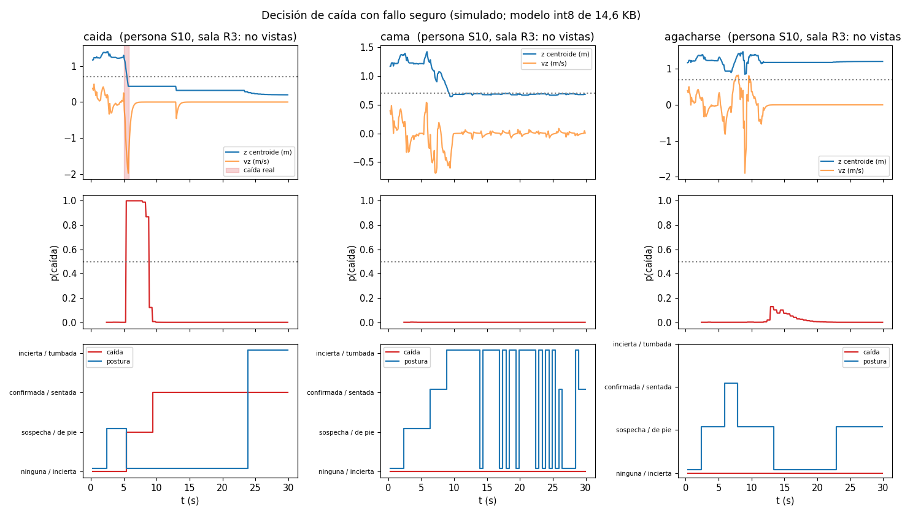

# radar60 · Sensor de presencia y caídas por radar de 60 GHz

Sensor de techo, sin cámara ni micrófono, que indica cuántas personas hay en
una habitación, dónde están y en qué postura, y notifica caídas. Detecta a
quien está completamente quieto por el movimiento del pecho al respirar. Todo
se calcula en el aparato y se publica por **Matter sobre Thread**, sin nube ni cuenta.

> **No es un dispositivo médico.** La detección de caídas es una notificación,
> nunca el único medio de seguridad de una persona.

## Estado: todo lo que se puede hacer sin hardware, hecho; pendiente de banco

| Bloque | Estado |
|---|---|
| F0 · Criterios numéricos, alcance, interfaces, plan, riesgos | ✅ [docs/](docs) |
| F0 · Contrato de características firmware ↔ entrenamiento (v1, 66 B) | ✅ [contracts/features_v1.yaml](contracts/features_v1.yaml) |
| F0 · Cadena de referencia Python: simulador FMCW → DSP → seguimiento → características → modelo int8 → decisión | ✅ [ml/radarref](ml/radarref) |
| F0 · Pruebas de regresión de los fallos conocidos (oclusión, ventilador, espejo, latencia) | ✅ 34 pruebas en verde |
| Firmware C portable: DSP, seguimiento, inferencia int8, decisión, aplicación completa | ✅ idéntico a la referencia de punta a punta; gcc y clang con `-Werror`, ASan/UBSan limpios; CI en [.github/workflows](.github/workflows/ci.yml) |
| F1 · Captura con el kit de evaluación y herramientas del banco ([ml/capture_kit.py](ml/capture_kit.py), [bench/](bench)) | ✅ código; ⏳ falta capturar en salas reales |
| F2 · Puerto EFR32MG26: driver del radar, Matter, diagnóstico por UART ([firmware/port/efr32mg26](firmware/port/efr32mg26)) | ✅ código (comprobado contra cabeceras simuladas); ⏳ compilar con el SDK de Silicon Labs y probar con el kit |
| F4 · Esquema rev A ([hardware/](hardware)) | ✅ ERC sin errores |
| F4 · PCB rev A (4 capas, Ø 60 mm) | ✅ colocada y rutada; DRC sin errores ni diferencias con el esquema; Gerber, BOM y posiciones en [hardware/fab/revA](hardware/fab/revA) ([cómo se hizo](hardware/scripts/README.md)); ⏳ contrastar con la guía de Infineon y pedir tras F2 |
| F4 · Mecánica: carcasa, tapa, radomo λ/2 y cupón ([mechanical/](mechanical)) | ✅ FreeCAD/STEP/STL; comprobado contra la placa montada real (0 mm³ de interferencias, clavija USB-C por la tapa); ⏳ imprimir y elegir espesor con el kit |
| F3 · Campaña de datos con personas, F5 · banco de 30 días-sensor, F6 · publicación de métricas | ⏳ requieren hardware, voluntarios con consentimiento y tiempo de banco |

Lo que falta ya no es diseño que pueda escribirse y verificarse en un PC: es
medir con el kit, compilar con el SDK propietario, fabricar la placa y hacer la
campaña de datos. El orden y las puertas están en [06](docs/06_plan_fases.md).

Todas las cifras actuales salen de **simulación**: validan que la cadena
funciona de extremo a extremo, no el producto. No se publican como métricas.




## Documentación

| | |
|---|---|
| [00 Alcance y límites](docs/00_alcance_y_guardrails.md) | qué es, qué no, respuesta a cada problema conocido |
| [01 Criterios de aceptación](docs/01_criterios_aceptacion.md) | umbrales numéricos y criterio de abandono |
| [02 Arquitectura](docs/02_arquitectura.md) | bloques, componentes, presupuesto de cómputo |
| [03 Interfaces y responsables](docs/03_interfaces_y_responsables.md) | I1–I6; el contrato de características |
| [04 Matter](docs/04_matter.md) | endpoints y clústeres |
| [05 Emisión 60 GHz](docs/05_regulatorio_60ghz.md) | límites en Europa y cómo se imponen |
| [06 Plan por fases](docs/06_plan_fases.md) | puertas de fase y material |
| [07 Protocolo de datos](docs/07_protocolo_datos.md) · [consentimiento](docs/07b_consentimiento_plantilla.md) | grabación, etiquetado, separación |
| [08 Banco de pruebas](docs/08_banco_pruebas.md) | escenarios y métricas con IC |
| [09 Hardware](docs/09_hardware.md) | BOM, puntos de prueba, fabricación |
| [10 Riesgos](docs/10_riesgos.md) | riesgos y limitaciones conocidas |

## Uso

Requisitos: Python 3.10+, `pip install -r requirements.txt`.

Pruebas (desde `ml/`):

```bash
python -m unittest discover -s tests -v
```

Figuras de los escenarios:

```bash
python plot_scenarios.py
```

Conjunto sintético, entrenamiento y evaluación por eventos:

```bash
python make_synth_dataset.py --jobs 4
```

```bash
python train.py
```

```bash
python eval_events.py
```

Tras cambiar el contrato (desde la raíz):

```bash
python tools/gen_contract.py
```

Firmware en PC (compila todo el código portable con `-Werror` y ejecuta las pruebas sin datos):

```bash
make -C firmware test
```

Equivalencia C ↔ Python con sanitizadores (desde `ml/`):

```bash
CC="gcc -fsanitize=address,undefined -fno-sanitize-recover=all" python -m unittest tests.test_firmware
```

## Estructura

```
bench/       banco de pruebas: anotación, eventos, exportación de HA, informe con IC
contracts/   contrato de características (fuente de verdad de I2)
docs/        ingeniería: criterios, arquitectura, plan, protocolo, banco, hardware
firmware/    C portable + pruebas contra vectores dorados de Python; port/ = capa del SDK
hardware/    KiCad: esquema y PCB rev A, huellas y modelos propios, scripts y fab/
mechanical/  carcasa, tapa y radomo (FreeCAD → STEP/STL) con comprobaciones
ml/          cadena de referencia, simulador, captura con el kit, entrenamiento, métricas
tools/       generadores (cabeceras C, vectores dorados), lector del diagnóstico UART
```
