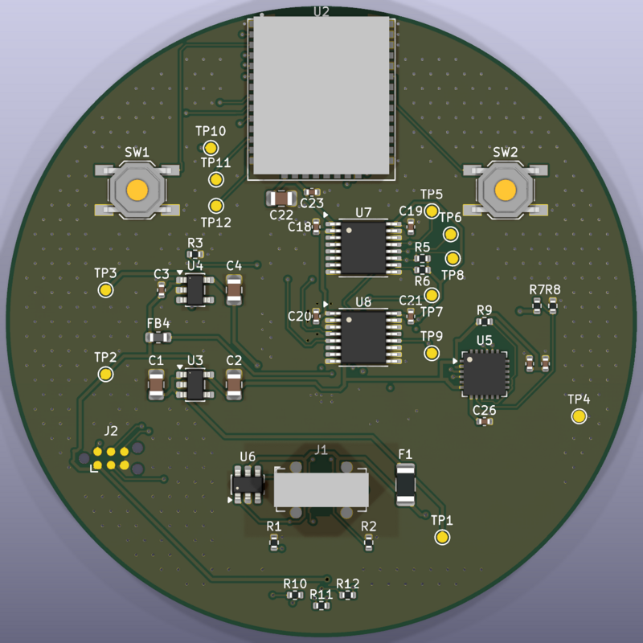
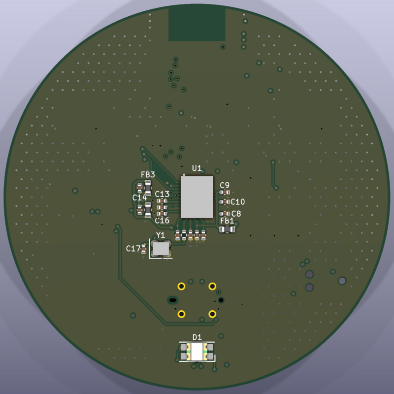

# 09 · Hardware (rev A, fase F4)

El esquema rev A y la PCB se han adelantado en paralelo a F1–F2 para tener
la placa lista cuando los kits validen la arquitectura; **no se pide a
fábrica antes de cerrar F2**, porque cualquier cambio de pines, reloj o
alimentación que salga de los kits se incorpora primero aquí. Este documento
fija los requisitos que el esquema cumple y el estado del diseño.

## Datos verificados en la hoja de datos del BGT60TR13C (v2.4.6)

- Encapsulado PG-VF2BGA-40-1: 6,5 × 5 × 0,9 mm, 40 bolas de 0,3 mm a paso
  0,5 mm (rejilla A–M × 1–9: perímetro más B3, B4 y B8; no hay M8). Antenas en
  la cara superior del chip: el radar va en la **cara inferior** de la placa,
  mirando al suelo.
- **E/S a 1,8 V (máximo absoluto 2 V)**: con el MCU a 3,3 V hacen falta
  traductores de nivel en CLK, DI, CS_N, DIO3 (reset), DO e IRQ.
- Alimentación: VDDD, VDDA, VDDRF, VDDVCO y VDDPLL a 1,8 V (201 mA típ.,
  230 mA máx. en activo); VDDLF a 3,3 V; VAREF (1,2 V) es una salida que solo
  lleva condensador de desacoplo.
- OSC_CLK: reloj CMOS de 1,8 V a 80 MHz (75–85 MHz; 78 MHz no permitido),
  jitter de fase ≤ 1 ps: oscilador XO, no cristal.
- Reset por hardware obligatorio tras el arranque: con CS_N = 1, DIO3 hace 1→0→1 (≥ 100 ns).
- FIFO de 8192 palabras de 24 bits (dos muestras de 12 bits por palabra); SPI hasta 50 MHz.
- Potencia TX máxima (#31) = +5 dBm; ganancia de antena 3,5 dBi típ. (5 máx.):
  **PIRE máx. ≈ 10 dBm**, por debajo de los 20 dBm de la UE.
- Separación entre antenas RX: 2,5 mm (λ/2), coherente con la referencia.

## BOM preliminar

| Ref | Pieza | Función | Notas |
|---|---|---|---|
| U1 | Infineon BGT60TR13C | radar 60 GHz, 1 TX / 3 RX, antenas en encapsulado | huella, apilado y reglas de la nota de aplicación de Infineon; copiar la disposición de su placa de referencia |
| U2 | Silicon Labs EFR32MG26 | MCU + Thread + BLE + MVP | módulo o chip; un módulo certificado simplifica la parte de 2,4 GHz |
| Y1 | 80 MHz (según hoja de datos del BGT60) | reloj del radar | lo más cerca posible de U1 |
| U3 | LDO de bajo ruido 1,8 V | alimentación del radar | ruido de alimentación ⇒ espurios en el espectro: elegir según recomendación de Infineon |
| U4 | LDO 3,3 V ≥ 500 mA | MCU y periféricos | |
| U5 | CP2102N | USB datos ⇄ UART | captura de registros y de tramas reducidas a 3 Mbaud |
| J1 | USB-C receptáculo 16 pines | alimentación 5 V + datos USB 2.0 | resistencias CC 5,1 kΩ; ESD en D+/D-; fusible rearmable |
| J2 | Tag-Connect TC2030 o 2×5 1,27 mm | SWD + reset + UART | accesible con la carcasa abierta |
| D1 | LED RGB | estado: puesta en marcha, error de radar, caída | apagable por configuración (dormitorio) |
| SW1 | pulsador | puesta en marcha / restablecer | accesible con clip |

## Requisitos del esquema

- Interfaz radar: SPI hasta 50 MHz, IRQ de FIFO, RST y, si existe, línea de
  disparo; nivel lógico compatible con el VDDIO elegido para U1 (verificar).
- Separación de dominios: el radar en un plano de masa continuo bajo U1;
  2,4 GHz de U2 en el extremo opuesto de la placa.
- Radar orientado al centro de la ventana del radomo; nada metálico (tornillos,
  blindajes, cobre) en el cono de ±60° delante de las antenas.
- Dimensiones objetivo: placa redonda Ø 60 mm, 4 capas.

## Estado de la PCB rev A

**Diseño terminado** (KiCad 10, `hardware/`): ERC sin errores, DRC sin errores
ni conexiones pendientes y sin diferencias con el esquema. Solo quedan dos
avisos: U7/U8 difieren de la biblioteca porque su marca de pin 1 se desplazó
0,9 mm para que no la tapen C18/C20. Ficheros de fabricación y procedimiento en
[hardware/scripts](../hardware/scripts/README.md).

 

| Aspecto | Decisión |
|---|---|
| Apilado | 4 capas JLC04161H-7628, 1,6 mm: F.Cu señal · In1 GND entero (sin pistas) · In2 alimentaciones/señal con relleno de GND · B.Cu radar |
| Radar U1 | cara inferior, centrado en la ventana del radomo (100, 100), fila de señales hacia los traductores; GND sólido en In2 bajo el encapsulado |
| Fan-out del BGA | sin vía en pad: las bolas de señal y alimentación están en el anillo exterior; pistas de 0,15-0,25 mm; B3/B4/B8 unidas a su vecina de GND; vías de GND dentro del anillo solo donde la cara superior está libre |
| Desacoplos del radar | cada bola de alimentación va directa a su condensador (≤ 3 mm), sin vía entre ambos; ferritas y bulk de cada raíl en la cara inferior |
| Reloj 80 MHz | M2 → R4 (22 Ω) → Y1 entero en B.Cu: 6,3 mm |
| SPI del radar | 13-17 mm por traza, vías escalonadas bajo U8 hacia los traductores |
| USB (velocidad completa) | D+/D- de 0,2 mm; protector ESD U6 con vía de GND en su pad |
| MGM260P | antena hacia el borde, sin cobre ni vías en ninguna capa bajo ella |
| GND | rellenos en las 4 capas, ~490 vías de cosido y una vía junto a cada pad de GND, todas validadas con la DRC |
| Mecánica | sin componentes sobre los apoyos de la carcasa; componente más alto 7,0 mm arriba (J1) y 1,19 mm abajo |

Comprobaciones mecánicas con la placa montada (STEP exportado de KiCad, ver
`mechanical/cad/comprobaciones.json`): interferencia placa-carcasa, placa-tapa
y componentes en el cono de ±60° de las antenas: 0 mm³. Una clavija USB-C con
funda de 12,4 × 6,6 mm colocada sobre el J1 real pasa por la tapa; el paso de
cable se movió a la vertical de J1, a 16 mm del centro (con el paso centrado
anterior la comprobación falla).

**Pendiente antes de pedir la placa** (no se puede cerrar desde aquí):

1. Contrastar la zona del radar con la guía de diseño de hardware de Infineon
   para el BGT60TR13C (no disponible en este entorno): reglas de cobre bajo el
   encapsulado, apilado recomendado y posición respecto al radomo. La placa
   cumple las reglas generales (GND continuo debajo, nada en el cono), pero no
   se ha verificado contra esa guía.
2. Confirmar en las hojas de datos la altura del MGM260P (2,2 mm supuesto) y del
   USB-C GT-USB-7051A (7,0 mm supuesto): son envolventes aproximadas.
3. Elegir piezas en LCSC (columna `LCSC` de `bom.csv`), comprobar existencias
   del BGT60TR13C y del MGM260P, y revisar las rotaciones del CPL en el visor
   del fabricante. El montaje es a doble cara.
4. Pedir solo tras cerrar F2: cualquier cambio de pines o alimentación que salga
   de los kits se incorpora antes aquí.

## Balance de alimentación (estimado; se mide en F2)

U3 (AP2112K-3.3, SOT-23-5) baja de 5 V a 3,3 V todo el consumo, incluido el
del radar a través de U4 (AP2112K-1.8). Estimación con el ciclo de trama v1
(32 chirps de 350 µs cada 100 ms, más ~2 ms de arranque y lectura del FIFO:
13 % de ciclo):

| Caso | 3V3 pico | U3 pico | 3V3 medio | U3 medio |
|---|---|---|---|---|
| Thread a +20 dBm | 416 mA | 0,71 W | 60 mA | 0,10 W (≈ +26 °C) |
| Thread a +10 dBm | 273 mA | 0,46 W | 59 mA | 0,10 W (≈ +25 °C) |

U4 disipa 0,34 W durante 13 ms en cada trama y unos 52 mW de media.

Supuestos:
- radar a 230 mA en activo (máximo de la hoja de datos) y 5 mA en reposo;
- MGM260P (módulo de 20 dBm: 162 mA a +20 dBm, 19 mA a +10 dBm según Silicon
  Labs) con un 1 % de tiempo en transmisión y 10 mA con la CPU y la recepción;
- CP2102N a 10 mA y LED encendido;
- θJA de 250 °C/W para el SOT-23-5.

Conclusión: la disipación media es aceptable y los picos duran milisegundos.
No se cambia el hardware, con dos condiciones:
1. Limitar la potencia de Thread a +10 dBm. En una vivienda basta para la malla
   y reduce el pico de 5 V a menos de 0,3 A, lejos de la corriente de
   mantenimiento del fusible rearmable (que cae con la temperatura).
2. Medir en F2 la corriente media y la temperatura de U3/U4 dentro de la
   carcasa cerrada. Si U3 supera 85 °C, sustituirlo por un regulador
   conmutado de 3,3 V.

## Puntos de prueba (obligatorios)

| TP | Señal | Para qué |
|---|---|---|
| TP1–TP3 | 5 V, 3,3 V, 1,8 V | puesta en marcha y medida de consumo |
| TP4 | GND | sondas (más GND en el Tag-Connect J2) |
| TP5–TP8 | SPI SCLK, MOSI, MISO, CS del radar | analizador lógico |
| TP9 | IRQ del radar | latencia y temporización de trama |
| TP10 | GPIO libre «trama procesada» | medir ciclos de DSP con osciloscopio |
| TP11–TP12 | UART TX/RX | consola sin USB |

## Fabricación (JLCPCB / PCBWay)

- Exportar con `bash hardware/scripts/fabricacion.sh` (falla si el ERC o la DRC tienen errores): Gerber, taladros, BOM y posiciones en `hardware/fab/revA/`.
- Pedir el apilado con control de impedancia que indique Infineon para la zona del radar.
- Montaje del BGT60TR13C por el fabricante (BGA/eWLB fino): verificar disponibilidad
  en su catálogo de componentes antes del pedido; si no lo hay, consigna de piezas.
- Lote rev A: 5 placas; 2 se reservan para pruebas destructivas/térmicas.

## Puesta en marcha (checklist)

1. Sin componentes de RF: rails, consumo en reposo, USB enumera.
2. SWD: programar firmware de diagnóstico; UART responde.
3. Radar: lectura del ID por SPI; trama de prueba; espectro sin espurios
   fijos con la sala vacía.
4. Mismo escenario que en el kit: los registros del contrato deben coincidir
   en distribución (presencia, recuento, altura) con los del kit.
