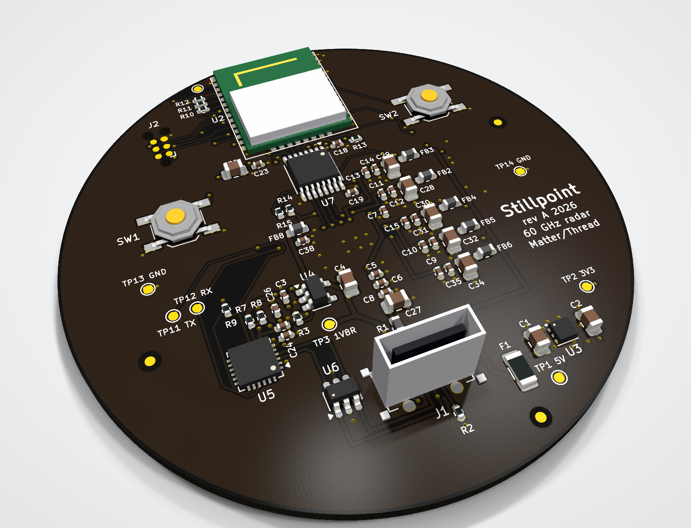
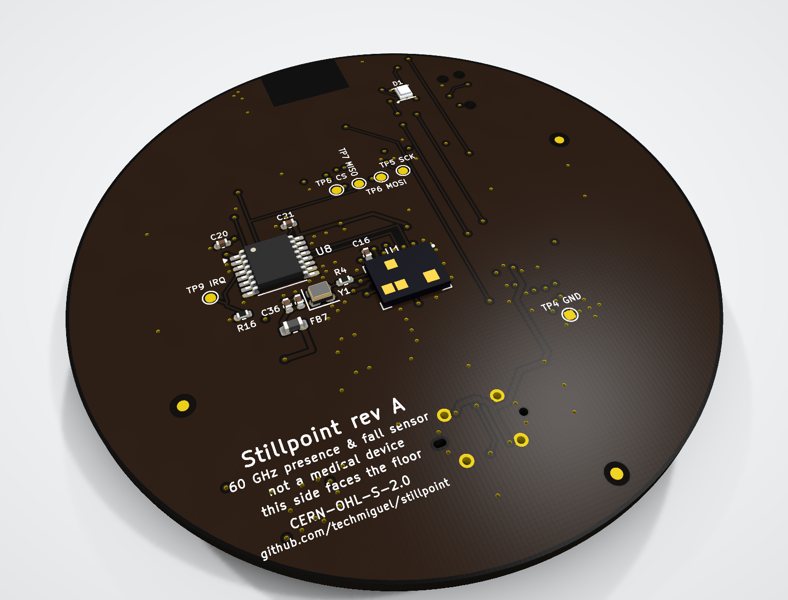
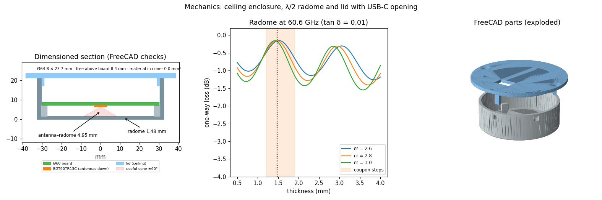

# Hardware (rev A)

A round Ø60 mm, 4-layer board that mounts on the ceiling. The 60 GHz radar sits on the
bottom face and looks at the floor through the radome; the Matter/Thread module sits at
the board edge with its built-in antenna. This page explains *why* the board is the way
it is. The sources are in [`hardware/`](../hardware) and the fabrication files in
[`hardware/fabrication/`](../hardware/fabrication).

| Top (ceiling side) | Bottom (faces the floor) |
|---|---|
|  |  |

The board was designed ahead of phases F1–F2 so it is ready when the kits have validated
the architecture. **It is not ordered before F2 closes**: any pin, clock or power change
the kits ask for lands here first.

## At a glance

| | |
|---|---|
| Size | Ø60 mm, 1.6 mm, 4 layers (JLCPCB JLC04161H-7628), ENIG, black mask |
| Parts | 74 placed (62 top, 12 bottom), 30 BOM lines, every one with MPN and LCSC number |
| Routing | 897 mm of track (635 mm top, 262 mm bottom), 164 vias, no tracks on the inner planes |
| Rules | 0.15/0.12 mm track/space by default (0.1 mm minimum), 0.3/0.55 mm vias; all inside JLCPCB's standard process |
| Checks | ERC 0 errors, DRC 0 (any severity), 0 unconnected, 0 schematic/PCB differences (any severity), `kicadverify verify` PASS |

## Block diagram

```
USB-C 5 V ─ F1 0.75 A ─ U3 TLV75733P (WSON, thermal pad) ─ +3V3 (L3 plane)
   │                                │
   └─ U6 USBLC6 ─ U5 CP2102N ─ UART ┤          └─ FB4 ─ VDDLF (3.3 V)
                                    │
                         U2 MGM260P (EFR32MG26, Matter/Thread, antenna at the edge)
                                    │  SPI + IRQ + RST + OE   (3.3 V)
                         U7 / U8 SN74AVC4T245 level translators
                                    │  (1.8 V)
+3V3 ─ U4 TPS7A2018 (7 µVrms, EN = PC03) ─ +1V8_RAD ─┬─ FB1 RF  ─┬─ FB5 PLL
                                                      ├─ FB2 A    ├─ FB6 VCO
                                                      ├─ FB3 D    ├─ FB7 OSC ─ Y1 80 MHz XO
                                                      └─ FB8 IO (VCCB of U7/U8)
                                                                 └─ U1 BGT60TR13C (bottom)
```

## Stackup

| Layer | Use |
|---|---|
| L1 (F.Cu) | MCU, translator U7, radar supply filters, USB, LDOs; signals; GND pour |
| L2 (In1) | **solid GND** over the whole board (except the module antenna keep-out) |
| L3 (In2) | **+3V3 plane**, with a **solid GND island under the radar** |
| L4 (B.Cu) | BGT60TR13C radar, 80 MHz oscillator, translator U8, RGB LED; GND pour |

Every GND or +3V3 pad has its own via to its plane (98 GND and 25 +3V3 vias). Return
currents never run along long tracks, and +3V3 reaches the radio module, which pulls
162 mA peaks when it transmits, with low impedance.

## Radar (U1, BGT60TR13C, PG-VF2BGA-40-1, bottom face)

- Centred under the radome window, 2.5 mm south of the board centre to make room for
  the translator and the module. The enclosure script uses the same position.
- 0.275 mm pads per Infineon UG091722 fig. 5c. The ball map is a perimeter ring with an
  empty centre: 6 GND vias go there, and the L3 GND island plus the L2 GND plane form the
  solid "no signals under the chip" ground Infineon asks for. A custom DRC rule
  (`radar_ground_only` in [`stillpoint.kicad_dru`](../hardware/stillpoint.kicad_dru)) keeps any
  other net off the inner layers under the radar.
- Fan-out in two staggered via rows north of row 1 (CLK, DI, DIO3, CS, VDDD, VDDA) and
  east of column M (LF, PLL, VCO); RF leaves north (M1) and south (F9+G9). VAREF has its
  470 nF capacitor on the same face, right at the ball.
- IRQ and DO run between the vias to translator U8 on the bottom face. Row 1 alternates
  inputs and outputs, so U7 (outputs to the radar) is on top and U8 (inputs from the
  radar) on the bottom: no radar line crosses another.
- Kyocera KC2016 80 MHz crystal oscillator with a 150 Ω series resistor 4 mm from ball
  M2, with its own filter (FB7, 1 µF, 10 nF).

## Radar power

Each radar supply domain is a **straight 0.3 mm lane** from its BGA via through
100 nF → 1 µF → 10 µF, ending at its ferrite; the ferrites hang off a 0.4 mm +1V8_RAD
bus. This is the π filter of UG091722 fig. 6, with the smallest capacitor as close to the
ball as it can be. The source is a 7 µVrms LDO, because the radar allows ≤ 20 µVpp of
supply noise from 20 to 700 kHz.

## MCU (U2, MGM260P) and pin map

The module sits at the north edge, centred, with the antenna keep-out of its datasheet
(fig. 8.2: 8.8 × 4.8 mm, all layers). The 60 mm ground plane is exactly the width
Silicon Labs recommends for the built-in antenna.

The radar signals leave from the module's **bottom pad row**, which faces translator U7
directly (EUSART can be routed to any port):

| Signal | Pin | Pad | Goes to |
|---|---|---|---|
| SPI SCLK | PA07 | 16 | U7 2A2 → CLK |
| SPI MOSI | PA08 | 17 | U7 2A1 → DI |
| RST (DIO3) | PD03 | 18 | U7 1A2 → DIO3 |
| CS | PD02 | 19 | U7 1A1 → CS_N |
| SPI MISO | PC00 | 22 | U8 1A2 ← DO |
| IRQ | PC01 | 24 | U8 1A1 ← IRQ |
| Translator OE_N | PC02 | 25 | U7/U8 1OE+2OE, 10 k pull-up |
| RADAR_PWR_EN | PC03 | 26 | U4 EN, 100 k pull-down |
| LED R/G/B | PB00/PB01/PB02 | 6/5/4 | D1 (common anode) |
| Button | PB03 | 3 | SW1 |
| Console | PA05 RX / PA06 TX | 12/13 | CP2102N |
| SWD | PA01/PA02/PA03 | 8/9/10 | J2 Tag-Connect |

PD00/PD01 stay free for an optional 32.768 kHz crystal. The same map is in
[`radar_pins.h`](../firmware/port/efr32mg26/radar_pins.h) and
[`verification/pcb/pins.yaml`](../verification/pcb/pins.yaml).

Safe start-up: R13 holds the translators' OE high (outputs high-Z) and R3 holds the radar
LDO off while the MCU is in reset. Firmware powers the radar, waits for the LDO and the
oscillator, drives CS_N and DIO3 high and only then enables the translators
([`radar_port.c`](../firmware/port/efr32mg26/radar_port.c)).

## USB-C

J1 is a vertical USB-C receptacle (7.5 mm tall), so the cable leaves through the lid
against the ceiling. The two VBUS pairs join through the gap between the pin rows; D- is
joined A7–B7 through the gap and D+ A6/B6 on the bottom layer. The ESD part (USBLC6) is
flow-through: J1 goes to its south pins and its north pins go on to the CP2102N, which is
rotated 180° so the pair runs straight.

## Bill of materials

Full BOM with MPN and LCSC numbers: [`BOM_JLCPCB.csv`](../hardware/fabrication/BOM_JLCPCB.csv).

| Ref | Part | Function | Notes |
|---|---|---|---|
| U1 | Infineon BGT60TR13C (C3606641) | 60 GHz radar, 1 TX / 3 RX, antennas in package | bottom face; stocked at JLC |
| U2 | Silicon Labs MGM260PB32VNA5 | EFR32MG26: MCU + Thread/Matter + MVP, built-in antenna | certified module at the edge; not at JLC (consigned) |
| Y1 | Kyocera KC2016K80.0000C1GE00 | 80 MHz 1.8 V clock, jitter ≤ 1 ps | the one on Infineon's shield board; R4 150 Ω in series |
| U4 | TI TPS7A2018 | 1.8 V 7 µVrms LDO for the radar | EN from the MCU, pull-down |
| U3 | TI TLV75733P (WSON-6) | 3.3 V 1 A LDO | thermal pad with vias to GND |
| FB1–FB8 | Murata BLM18KG601SN1D | π filter per radar domain | 0.15 Ω, 1.3 A |
| U7, U8 | TI SN74AVC4T245 | 3.3 V ⇄ 1.8 V translators | OE active low with pull-up |
| U5 | Silicon Labs CP2102N | USB ⇄ UART | 3 Mbaud records |
| U6 | ST USBLC6-2SC6 | ESD on D+/D- and VBUS | |
| J1 | G-Switch GT-USB-7051A | vertical 16-pin USB-C | cable leaves through the lid |
| F1 | PTTC SMD1206P075TFT | 0.75 A resettable fuse | |
| J2 | Tag-Connect TC2030-NL | SWD + reset + SWO | footprint only |
| D1 | Yongyu SZYY1615RGB-B | common-anode RGB status LED | bottom face, seen through the radome; ~2 mA per colour |
| SW1, SW2 | E-Switch TL3342 | setup / reset | |

## Checked against the datasheets

| Part | What was checked | Result |
|---|---|---|
| BGT60TR13C (table 1) | 40 balls and their functions | matches the schematic and `verification/pcb/pins.yaml` |
| BGT60TR13C | 1.8 V I/O (2 V absolute max) | level translators on CLK, DI, CS_N, DIO3, DO and IRQ |
| BGT60TR13C (§8.1) | VAREF | low-ESR **470 nF** (C16) next to ball L1 |
| BGT60TR13C (table 5) | supply noise ≤ 20 µVpp at 20–700 kHz | TPS7A2018 (7 µVrms) and a π filter per domain, 100 nF + 1 µF + 10 µF |
| BGT60TR13C (table 5) | clock 75–85 MHz, CMOS 1.8 V, jitter ≤ 1 ps | Kyocera KC2016 crystal XO; a MEMS SiT8008 (1.3–2 ps) does not qualify |
| BGT60TR13C | max TX power +5 dBm, antenna gain 3.5 dBi typ. | **≈ 10 dBm EIRP max**, below the EU 20 dBm |
| Shield board UG091722 (fig. 5c, §3.3, §3.4) | land pattern, filters, clock series resistor | 0.275 mm pads; filter per domain; R4 150 Ω, tuned on the bench |
| MGM260P (table 2.1, 6.1, fig. 8.1, 8.2) | ordering code, pinout, land pattern, height, antenna keep-out | MGM260PB32VNA5 (+20 dBm); 11.30 mm columns, 2.4 × 0.6 pads, 8.8 × 4.8 mm keep-out; 2.35 mm max height fits under 8.4 mm of free space |
| GT-USB-7051A (drawing) | land pattern and height | holes ±2.4/±2.15, slots ±3.75, 7.5 mm tall; the centre pegs are plastic, no holes |
| SN74AVC4T245 | DIR/OE, unused inputs | DIR high A→B, OE active low with pull-up; U8 2B1/2B2 tied to GND as TI requires |
| CP2102N (fig. 2.3) | self-powered without the regulator, RSTb, VBUS sense | VREGIN = VDD = 3.3 V, 1 kΩ on RSTb, 22.1/47.5 kΩ divider; **4.7 µF + 0.1 µF** decoupling |
| USBLC6-2 | pinout | correct; D+/D- flow through the part |
| SZYY1615RGB-B | pinout | 1 R, 2 G, 3 B, 4 common anode (LCSC pattern of C3029071), same as the symbol |

Datasheet links: [references.md](references.md).

## Design review history

The first schematic passed its pin checks but failed review on three component choices
that would have hurt the radar or the 2.4 GHz radio. They were fixed before layout:

| Before | After | Why |
|---|---|---|
| AP2112K-1.8 radar LDO (50 µVrms) | TPS7A2018 (7 µVrms), same SOT-23-5 pinout | the radar allows < 20 µVpp from 20 to 700 kHz |
| SiT8008 MEMS oscillator (1.3–2 ps) | KC2016 crystal XO (≤ 1 ps) with its own ferrite and a tunable series resistor | radar clock jitter limit; matches Infineon's shield board |
| One shared 1.8 V rail | separate π filter for RF, A, D, PLL, VCO, OSC and LF; translator VCCB on its own branch | UG091722 §3.3, fig. 6; keeps SPI noise out of the radar's digital supply |
| 3.3 V LDO in SOT-23-5 | TLV75733P in WSON-6 with thermal pad | 0.7 W peak would heat a SOT-23-5 by ~128 °C |
| Translators always enabled | OE_N with pull-up, CS_N/DIO3 pull-ups, IRQ pull-down | defined levels while the MCU is in reset |

## Power budget

Estimated; measured in F2. U3 brings everything from 5 V to 3.3 V, including the radar
through U4. Frame cycle: 32 chirps of 350 µs every 100 ms plus ~2 ms of start-up and FIFO
read (13 % of the time).

| | 3V3 | Dissipation in U3 |
|---|---|---|
| Peak (radar active and TX at +20 dBm together) | ≈ 410 mA | ≈ 0.70 W, only during the overlap |
| Average | ≈ 60 mA | ≈ 0.10 W |

U4 dissipates (3.3 − 1.8) V × 230 mA ≈ 0.34 W during each burst and about 50 mW on
average. Assumptions (datasheets): radar 230 mA active (max) and 2.8 mA idle; MGM260P
162 mA transmitting at +20 dBm (1 % of the time), 6 mA receiving and about 4 mA of CPU;
CP2102N 10 mA; LED about 2 mA per colour. The 5 V peak stays below 0.45 A, well under the
0.75 A hold current of F1. If less power were needed, the MGM260PB22VNA5 (+10 dBm) has the
same package and pinout.

## Test points

| TP | Signal | Use |
|---|---|---|
| TP1–TP3 | 5 V, 3.3 V, 1.8 V radar | bring-up and current measurement |
| TP4, TP13, TP14 | GND (×3, spread out) | probes |
| TP5–TP8 | radar SPI SCLK, MOSI, MISO, CS | logic analyser |
| TP9 | radar IRQ | latency and frame timing |
| TP10 | "frame processed" GPIO | DSP cycle time on a scope |
| TP11–TP12 | UART TX/RX | console without USB |

## Mechanics

- The board rests on three enclosure supports at 30°, 150° and 270° and the lid clamps it
  with three posts at the same angles: both faces are kept free of parts there
  (`SUPPORT_*` zones on the board).
- The λ/2 radome (1.48 mm for εr = 2.8) sits exactly 4.95 mm (λ0) from the antennas.
- [`mechanical/enclosure.py`](../mechanical/enclosure.py) loads the real board STEP (every
  part with a 3D model) and asserts that nothing touches the enclosure, the lid or the
  radome and that there is no material in the ±60° antenna cone. Results in
  [`checks.json`](../mechanical/cad/checks.json): 0 mm³ of interference, tallest part
  7.5 mm (USB-C) against 8.4 mm of free height.



## Verification

- ERC: 0 errors. The 2 warnings are intended: U8's unused B-side inputs are tied to GND,
  as TI requires.
- DRC: **0 violations of any severity**, 0 unconnected, 0 schematic/PCB parity issues of
  any severity, with the rules in `stillpoint.kicad_pro` and `stillpoint.kicad_dru`.
- The schematic is laid out by function, with block headings; [`tools/sch_tidy.py`](../tools/sch_tidy.py)
  keeps every pin label pointing away from its symbol and every reference and value clear
  of the labels.
- [`kicadverify verify`](https://github.com/techmiguel/kicad-verify): ERC, DRC, parity, pin
  maps against the datasheets ([`pins.yaml`](../verification/pcb/pins.yaml)), circuit
  checks, Gerber/drill/BOM/CPL against the board: **PASS**. Each exception is in
  [`waivers.yaml`](../verification/pcb/waivers.yaml) with its reason.
- Still open, needing the board in hand (HUM-* sign-offs): 1:1 print, polarities, CPL
  rotations in the JLCPCB viewer, prototype bring-up.

## Fabrication (JLCPCB)

```bash
python tools/export_fab.py
```

writes Gerber (X2), Excellon drills, JLCPCB BOM and CPL, the schematic PDF and the board
STEP to `hardware/fabrication/`, always from the current board.

- Double-sided assembly. The BGT60TR13C is stocked at JLC (C3606641). The MGM260P and the
  KC2016 are not: Global Sourcing or consigned parts. Check the CPL rotations in the
  fabricator's viewer before ordering.
- J2 is only the footprint for the Tag-Connect TC2030-NL cable: not fitted, not in the BOM.
- Rev A batch: 5 boards; 2 kept for destructive and thermal tests.

## Bring-up checklist

1. Before the radar: rails, idle current, USB enumerates.
2. SWD: flash the diagnostic firmware; the UART answers.
3. Measure +3V3 and +1V8_RAD on TP2 and TP3 with RADAR_PWR_EN high; check the 80 MHz
   clock at R4.
4. Read the radar ID over SPI (TP5–TP8); take a test frame; with the room empty the
   spectrum shows no fixed spurs. Tune R4 on the range-Doppler map (UG091722 §3.4).
5. Same scenario as on the kit: the contract records must match the kit's in
   distribution (presence, count, height).

## How the layout was made

Placement and every critical route (BGA escape, radar supply lanes, USB-C breakout and
pair) are written as scripts in [`tools/pcb_build/`](../tools/pcb_build); Freerouting
routes the rest without touching the locked items. Every decision can be read in code and
the board can be rebuilt from the schematic with `sh tools/pcb_build/pipeline.sh`.
